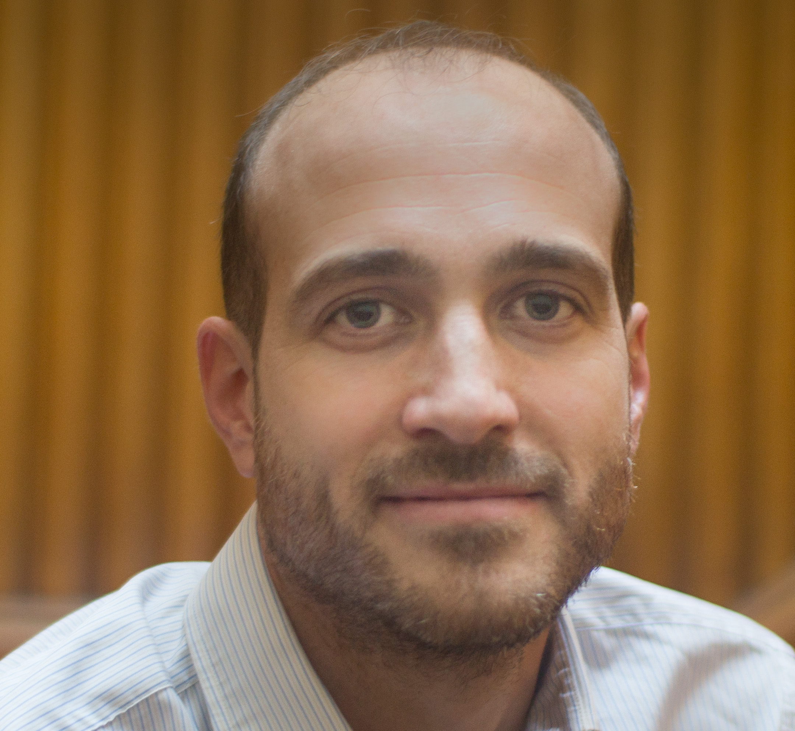
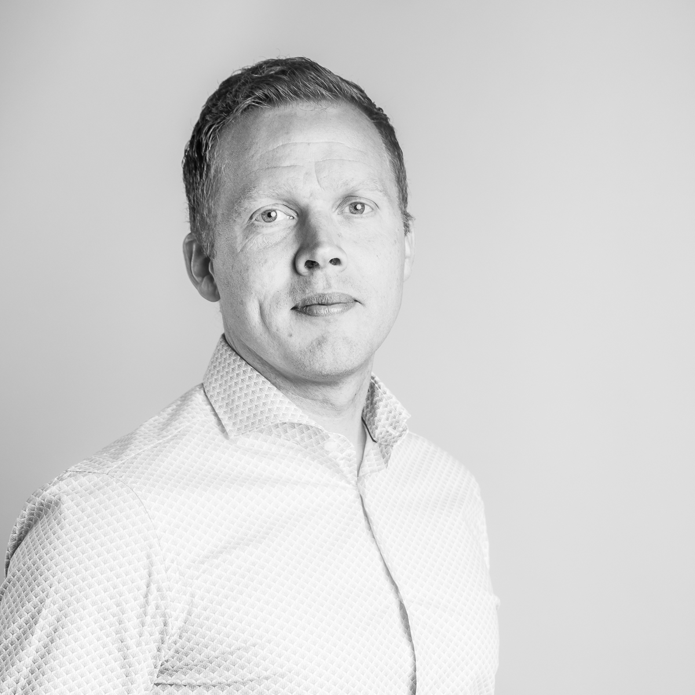

<h1 style="text-align: center">Keynote Speakers</h1>

        

			
		

		

            
Katharina Morik

            
TU Dortmund University

        

    

 

Machine Learning for Sustainability

<!-- <button class="collapsible">Abstract -->
	

	

  In September 2015, the general assembly of the United Nations passed
  17 goals for sustainability development that are to be reached until
  2030. This is an extension of the millennium development goals
  declaration from 2000. Since then, data analysis has contributed in
  several ways to sustainability, particularly in earth and climate
  science, in sustainable industrial production, and resource-efficient
  transportation.
  
  This talk will give a short overview of the data-driven approaches and then present some approaches in more detail.
  Illustrating earth science, a novel method for gap filling in satellite images is presented.
  Sustainability for industrial production is presented with an example in steel production.
  The general view of resource-efficient computation is exemplified by Integer Markov Random Fields.
  Although there are already many approaches, a lot of work still needs to be done for lifting the full potential of machine learning for sustainability development.

	

   

<button class="collapsible">Bio

<!--    -->

  Katharina Morik received her doctorate from the University of Hamburg in 1981 and her habilitation from the TU Berlin in 1988. In 1991, she established the chair of Artificial Intelligence at the TU Dortmund. Currently, her research interest is in learning under resource restrictions, e.g., in astrophysics, industry 4.0, or mobility.
      
  In 2011, she acquired the Collaborative Research Center SFB 876 "Providing Information by Resource-Constrained Data Analysis” and is its spokeswoman since then.
  She is a director of the Competence Center for Machine Learning Rhein Ruhr (ML2R) and coordinator of the four German competence centers for machine learning.

</button>

  The globally successful data analysis tool RapidMiner was developed at her lab.
  She is a leader of the working group "Technological Pioneers" of the German platform "Learning Systems and Data Science”.
     
  She is the author of more than 200 publications in prestigious journals and conferences. Her focus on sustainability is seen, e.g., in the workshops SustainKDD at KDD 2011 and 2012 as well as the special issue in Data Mining and Knowledge Discovery 2012 and the coediting with Jörg Lässig and Kristian Kersting the book “Computational Sustainability” in 2016. She was a member of the editorial board of the journal Machine Learning and is currently one of the editors of the international journal Data Mining and Knowledge Discovery. She was a founding member, Program Chair and Vice Chair of the conference series IEEE International Conference on Data Mining (ICDM), Senior Chair of KDD, Area Chair of ICML, and Program Chair of ECML PKDD.
     
  Prof. Morik has been a member of the Academy of Technical Sciences since 2015 and of the North Rhine-Westphalian Academy of Sciences and Arts since 2016.

  

   

		

		

      
Paul Whatmough (Online)
			

            
Arm ML Research Lab and Harvard University

        

    

 

Algorithm-Hardware Co-Design for Energy-Efficient Neural Network Inference

	

	

    Machine learning has had a huge impact on consumer electronics devices, including IoT, mobile and automotive.  However, all these compute platforms are battery powered, which makes it challenging to use state-of-the-art machine learning models which typically demand an enormous number of arithmetic operations and a large memory footprint.

      
    In this talk, we will explore techniques for designing neural networks for energy-efficient inference on resource constrained devices.  In particular, we will emphasize the co-design of model and hardware, as a key approach to achieving state-of-the-art performance for real-time, energy-constrained inference applications on microcontrollers and mobile chips.
	

  

	 Bio 
	

	

    Paul Whatmough received the Doctorate degree from University College London, UK.
    He was previously with Philips, NXP, Arm, and Harvard, working in the areas of ML, DSP, wireless, accelerators, and circuits.
    Currently, he leads research at Arm ML Research Lab Boston, and is an Associate at Harvard.
	

     
        

			
		

		

            
Rikard König

            
Ekkono Solutions

        

    

 

Edge Machine Learning in Practice

<!-- <button class="collapsible">Abstract -->
	

	

  This talk will focus on challenges and opportunities when applying machine learning on edge devices. More specifically the talk will follow the journey and experiences from founding a company based on a research prototype, refining it to a real product and applying it to real world edge machine learning problems.
    
  The talk will draw upon experiences from numerous IoT projects performed during the last two years. Opportunities and challenges will be discussed in relation to implementation and algorithmic related requirements. A specific focus will be on incremental learning techniques since these has shown to be well suited for edge analytics.

	

   

	 Bio 
	

<!--    -->

Rikard König, PhD, is co-founder and CTO at Ekkono Solutions and Senior Lecturer at the University of Borås, Sweden. At the University of Borås he is a member of CSL@BS, a research group of ten researchers specializing in machine learning and high-performance computing. The focus of his research is design of new or enhanced machine learning algorithms.
   
In December 2016, he co-founded Ekkono Solutions together we three other partners, based on the outcome of his research. Ekkono provides a resource efficient solution that can run most applicable machine learning techniques on small platforms, i.e. an edge computing platform for connected things. Today the company have grown to 17 employees and targets large industrial companies and have customers such as Siemens, Volvo, ABB and Alfa Laval.

